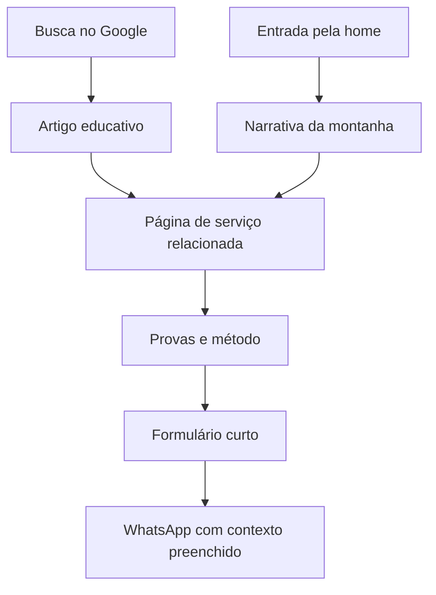

# VELMONT

## Blueprint estratégico, criativo e técnico do novo site

**Versão:** 1.0
**Data:** 31 de agosto de 2026
**Objetivo:** orientar estratégia, copywriting, design, conteúdo, desenvolvimento e validação do novo site da Velmont no Claude Code.

---

## 1. Decisão central

O site não deve parecer um escritório jurídico convencional, nem uma landing page de marketing cheia de promessas. Ele deve materializar o principal diferencial da Velmont:

> **Tornar claro aquilo que o mercado costuma deixar obscuro.**

Isso significa explicar o que está em risco, o que pode ser protegido, quais caminhos existem e o que acontece em cada etapa. A experiência visual pode ser sofisticada e surpreendente, mas a mensagem deve continuar simples.

### Grande ideia da marca no site

> **O que você constrói merece continuar sendo seu.**

Essa é a frase que deve organizar a narrativa da home, os serviços, o blog e a conversão.

### Assinatura narrativa

> **Da ideia ao patrimônio.**

Ela funciona como um fechamento conceitual, não como substituta da chamada principal.

### Promessa operacional

> **Clareza para decidir. Estratégia para proteger. Presença para acompanhar.**

Essa tríade resume os diferenciais confirmados na entrevista:

- riscos e possibilidades explicados sem promessas vazias;
- transparência durante todo o processo;
- acompanhamento proativo;
- proximidade real das fundadoras.

---

## 2. O que o site precisa fazer

### Objetivo comercial principal

Levar o visitante a **solicitar uma análise estratégica** por meio de um formulário curto que gera uma mensagem organizada no WhatsApp.

### Objetivos secundários

1. Fazer uma pessoa leiga entender rapidamente o que a Velmont protege.
2. Dar destaque comercial a três territórios:
   - registro e proteção de marcas;
   - software, direitos autorais e contratos;
   - patentes e desenho industrial.
3. Construir confiança por meio de provas concretas.
4. Atrair buscas orgânicas com um blog educativo.
5. Reduzir objeções antes do primeiro contato.
6. Permitir que a própria equipe da Velmont publique artigos.

### Percepção desejada nos primeiros cinco segundos

**Clara, acessível e transparente.**

O visual pode ser premium, mas nunca distante. A sofisticação deve vir da direção de arte, da tipografia, do ritmo e da precisão - não de palavras difíceis.

---

## 3. O que não fazer

Evitar deliberadamente os sinais que deixam um site com "cara de IA" ou de template:

- vários cards arredondados iguais em uma grade previsível;
- glassmorphism, brilhos, neon e gradientes aleatórios;
- ícones genéricos de escudo, cadeado, martelo ou balança;
- textos vagos como "soluções completas", "excelência", "inovação" e "atendimento personalizado" sem prova;
- animação em cada elemento apenas para demonstrar movimento;
- números inventados ou placeholders publicados;
- fotografias genéricas de aperto de mãos e reuniões de banco de imagem;
- um site inteiro com scroll horizontal;
- parágrafos longos centralizados;
- carrossel automático sem controle do usuário;
- loaders artificiais que atrasam a entrada;
- navegação experimental que faz o usuário precisar descobrir como usar o site.

O impacto deve vir de **uma ideia forte executada com consistência**.

---

## 4. Conceito visual: a montanha como sistema, não como enfeite

O símbolo da Velmont contém uma montanha. Em vez de usar um PNG subindo pela tela, o site deve transformar a geometria do símbolo em uma linguagem visual própria.

### Significado

A montanha representa a passagem entre quatro estados:

1. **Ideia** - algo começa a ser criado.
2. **Valor** - ganha nome, forma, código, reputação ou aplicação comercial.
3. **Exposição** - quanto mais cresce, mais sujeito fica a cópia, disputa e perda.
4. **Patrimônio** - a proteção dá estrutura para esse valor continuar pertencendo ao negócio.

### Execução visual

- Reconstruir o contorno original da montanha como **SVG vetorial**, a partir do arquivo oficial da marca.
- Usar o traço da montanha como caminho de leitura e indicador de progresso.
- Derivar linhas topográficas, recortes diagonais e níveis de altitude a partir do símbolo.
- Animar o `stroke-dashoffset` do SVG conforme o scroll.
- Fazer a câmera visual "subir" por diferentes níveis, sem simular uma montanha fotográfica literal.
- No ponto mais alto, revelar a frase **"Da ideia ao patrimônio."**

### Regra importante

A montanha deve aparecer em uma grande sequência narrativa e depois sobreviver de forma discreta no restante do sistema: divisores, marcadores, máscaras de fotografia e pequenos detalhes de progresso.

Não repetir a mesma animação em todas as páginas.

---

## 5. Arquitetura do site

### Navegação principal

- O que protegemos
- Como atuamos
- Conteúdos
- Sobre a Velmont
- Botão: **Solicitar análise**

### Sitemap recomendado

```text
/
├── /servicos
│   ├── /registro-de-marca
│   ├── /software-direitos-autorais-e-contratos
│   ├── /patentes-e-desenho-industrial
│   ├── /estruturacao-empresarial
│   └── /naming-e-identidade
├── /como-atuamos
├── /sobre
├── /conteudos
│   ├── /marcas
│   ├── /software-e-direitos-autorais
│   ├── /patentes-e-inovacao
│   └── /[slug-do-artigo]
├── /analise-estrategica
├── /politica-de-privacidade
└── /404
```

### Hierarquia comercial

As três primeiras páginas de serviço devem dominar a home, a navegação e os links internos. Estruturação empresarial, naming e identidade continuam acessíveis, mas aparecem como capacidades complementares, sem disputar o primeiro nível de atenção.

---

## 6. Jornada de conversão



O blog não deve ser um destino isolado. Todo artigo deve conduzir naturalmente a uma página de serviço e, depois, à análise estratégica.

---

## 7. Home: roteiro completo, seção por seção

### 7.1. Cabeçalho

**Comportamento**

- Transparente sobre o hero.
- Torna-se sólido após o primeiro trecho de scroll.
- Logo à esquerda.
- Navegação simples ao centro ou à direita.
- CTA sempre visível no desktop.
- No mobile, menu de tela cheia com as mesmas rotas e CTA destacado.

**Não usar** mega menu complexo no primeiro lançamento.

---

### 7.2. Hero - a afirmação

**Eyebrow**
Proteção estratégica para marcas, criações e inovações.

**Título principal**

> **O que você constrói merece continuar sendo seu.**

**Texto de apoio**
A Velmont protege marcas, softwares, criações e inovações com estratégia, transparência e acompanhamento próximo em cada etapa.

**CTA principal**
Solicitar análise estratégica

**CTA secundário**
Descobrir o que proteger

**Linha de confiança**
Riscos explicados. Caminhos claros. Acompanhamento próximo.

**Direção visual**

- Fundo vinho profundo.
- Tipografia editorial grande em areia ou marfim.
- Montanha em linha fina, parcialmente visível.
- Pequena indicação de scroll com a palavra "Comece pela ideia".
- Nada de foto de escritório no hero. A identidade deve ser o primeiro impacto.

**Movimento**

- A montanha começa como um fragmento.
- O texto entra em dois tempos, sem animação letra por letra excessiva.
- A linha da montanha responde suavemente ao ponteiro apenas em desktop.
- A próxima seção começa a ser antecipada no rodapé do hero.

---

### 7.3. Sequência principal - a subida

**Altura sugerida:** entre `220vh` e `280vh` no desktop.
**Comportamento:** palco fixado enquanto o scroll controla uma timeline.

#### Beat 1 - origem

> **Primeiro, existe uma ideia.**

Texto auxiliar:
Um nome. Um código. Um desenho. Uma solução que ainda não existia.

#### Beat 2 - valor

> **Depois, ela ganha valor.**

Texto auxiliar:
Entra no mercado, conquista clientes, acumula reputação e passa a mover o negócio.

#### Beat 3 - exposição

> **Quanto mais cresce, mais exposta fica.**

Texto auxiliar:
Cópias, conflitos de titularidade, impedimentos e decisões tomadas tarde demais.

#### Beat 4 - proteção

> **Proteger não é frear o crescimento. É dar estrutura para ele continuar.**

Fechamento:
**Da ideia ao patrimônio.**

**Coreografia**

- O traço do SVG é desenhado conforme o avanço.
- Cada beat ocupa uma "altitude".
- Linhas topográficas surgem com opacidade muito baixa.
- Palavras-chave podem se fixar por alguns instantes: `ideia`, `valor`, `risco`, `patrimônio`.
- O final da linha conecta fisicamente à seção de serviços.

**Mobile**

- Não fixar uma seção de 280vh.
- Exibir quatro blocos verticais com o SVG desenhado ao lado.
- Manter a leitura natural e reduzir a quantidade de parallax.

---

### 7.4. Diagnóstico de entrada - "O que você está construindo?"

**Título**

> **Nem todo ativo se protege do mesmo jeito.**

**Texto**
A análise começa entendendo o que você criou, em que estágio está e onde o risco realmente existe.

Criar três escolhas visuais:

1. Tenho uma marca ou um nome em uso.
2. Criei software, conteúdo ou outra obra.
3. Desenvolvi um produto, desenho ou tecnologia.

Ao selecionar uma opção:

- destacar a trilha correspondente;
- mostrar uma explicação de duas linhas;
- oferecer "Entender esta proteção";
- manter disponível "Ainda não sei", levando à análise estratégica.

Essa interação deve ser utilizável por teclado e não pode depender apenas de hover.

---

### 7.5. Territórios de proteção - scroll horizontal contido

Esta é a única seção horizontal do site. O usuário continua rolando verticalmente, e o trilho se desloca lateralmente dentro de um palco fixo.

**Cabeçalho fixo da seção**
O que a Velmont ajuda a proteger

**Indicador**
`01 / 03`, `02 / 03`, `03 / 03`

#### Painel 01 - Marcas

**Chamada**

> **Seu nome já circula. Mas ele está protegido para crescer?**

**Resumo**
Pesquisa, estratégia de registro, acompanhamento e monitoramento para marcas em diferentes estágios.

**Itens curtos**

- pesquisa de anterioridade;
- análise de viabilidade;
- registro e acompanhamento;
- monitoramento e estratégia de proteção.

**Link**
Proteger uma marca

#### Painel 02 - Software, autoria e contratos

**Chamada**

> **Código, conteúdo e autoria também são patrimônio.**

**Resumo**
Proteção de software e criações, definição de titularidade, registros, cessões e licenciamentos.

**Itens curtos**

- registro de software;
- direitos autorais;
- prova de autoria e anterioridade;
- contratos, cessão e licenciamento.

**Link**
Proteger uma criação

#### Painel 03 - Patentes e desenho industrial

**Chamada**

> **Antes de mostrar uma inovação ao mercado, entenda o que pode ser protegido.**

**Resumo**
Análise técnica e estratégica para invenções, modelos de utilidade, desenho industrial e liberdade de operação.

**Itens curtos**

- busca de anterioridade;
- patentes e modelos de utilidade;
- desenho industrial;
- análise de Freedom-to-Operate.

**Link**
Proteger uma inovação

**Direção visual dos painéis**

- Não usar três cards pequenos.
- Cada painel deve ocupar de 75% a 85% da viewport.
- Alternar composição: texto de um lado, forma topográfica ou fotografia de detalhe do outro.
- Cantos discretos, quase retos.
- Número grande e linha de altitude como elemento de continuidade.

**Mobile**

- Transformar os três painéis em capítulos empilhados.
- Não exigir gesto horizontal.

---

### 7.6. Método - transparência como experiência

**Título**

> **Você não deveria contratar proteção sem entender o caminho.**

**Texto**
Na Velmont, cada decisão é explicada antes de ser tomada. Sem processos no escuro. Sem promessas que ninguém pode garantir.

#### Etapas

**01. Entendemos o ativo**
O que foi criado, em que estágio está e qual papel exerce no negócio.

**02. Investigamos o cenário**
Anterioridades, riscos, possibilidades e caminhos de proteção.

**03. Explicamos as escolhas**
O cliente entende o que faz sentido, o que não faz e por quê.

**04. Acompanhamos a execução**
Atualizações proativas e proximidade durante cada etapa.

**Interação**

Uma linha vertical sobe entre as etapas. Ao entrar em cada nível, o texto auxiliar aparece. Não esconder informações essenciais atrás da animação.

---

### 7.7. Números e evidências

**Título**

> **Autoridade se demonstra.**

Usar somente dados reais, verificáveis e aprovados:

- `[X]+ anos` de experiência;
- `[Y]+ processos` conduzidos;
- `[Z/5]` ou `[Z%]` de satisfação.

**Importante:** os valores exatos ainda não foram fornecidos. Manter os dados em um arquivo central de conteúdo e bloquear publicação enquanto houver placeholders.

Logo abaixo, exibir logos de clientes e parceiros autorizados. Evitar uma "nuvem de logos" desorganizada; usar uma faixa limpa, monocromática e com contraste adequado.

---

### 7.8. Fundadoras - proximidade com rosto e voz

**Título**

> **Quem orienta também acompanha.**

**Texto**
Na Velmont, o relacionamento estratégico permanece próximo das fundadoras. Isso significa contexto preservado, decisões explicadas e responsabilidade em cada etapa.

Apresentar Danielle e Lisandra em uma composição editorial:

- retratos verticais grandes, não recortes circulares;
- nome e função;
- formação resumida em até três linhas;
- uma frase pessoal sobre a razão de existir da Velmont;
- link para a história completa na página Sobre.

**Sugestão de frase de Danielle**
"Confiança não se vende. Ela se constrói quando o cliente entende o que está acontecendo."

**Sugestão de frase de Lisandra**
"Marca é patrimônio. E patrimônio exige estratégia, cuidado e responsabilidade."

Confirmar a redação final com as fundadoras antes da publicação.

---

### 7.9. Depoimentos

**Título**

> **Confiança se constrói em cada atualização.**

Usar depoimentos completos, com nome, empresa e autorização. Priorizar relatos que comprovem:

- clareza;
- acompanhamento;
- agilidade de comunicação;
- segurança na tomada de decisão.

No desktop, usar um trilho controlável ou uma pilha editorial. No mobile, usar cartões empilhados ou carrossel com botões e indicadores. Nunca depender de autoplay.

---

### 7.10. Conteúdos

**Eyebrow**
Conteúdo para decidir melhor

**Título**

> **Entender vem antes de proteger.**

**Texto**
Respostas claras para quem quer proteger marca, criação ou inovação com critério - não com medo.

Estrutura inicial:

- um artigo principal em destaque;
- três artigos recentes;
- filtros pelas três categorias prioritárias;
- CTA "Ver todos os conteúdos".

Cada cartão deve mostrar título, resumo real, categoria, data de atualização e tempo estimado de leitura.

---

### 7.11. Conversão final

**Título**

> **Você sabe o que está construindo. Vamos entender como proteger.**

**Texto**
Conte brevemente o momento do seu negócio. A equipe da Velmont analisará o contexto e continuará a conversa pelo WhatsApp.

#### Campos do formulário

1. Nome
2. Empresa ou marca
3. O que deseja proteger?
   - marca;
   - software ou criação;
   - produto, desenho ou tecnologia;
   - ainda não sei.
4. Em que momento está?
   - começando;
   - já está em operação;
   - pretende lançar em breve;
   - existe um risco ou conflito.
5. Contexto adicional - opcional e curto
6. Aceite de privacidade

**Botão**
Continuar no WhatsApp

#### Mensagem gerada

```text
Olá, Velmont. Vim pelo site e gostaria de solicitar uma análise estratégica.

Nome: {nome}
Empresa ou marca: {empresa}
Quero proteger: {tipo}
Momento atual: {momento}
Contexto: {contexto}
```

Gerar o link oficial `wa.me` com texto codificado por `URLSearchParams` ou `encodeURIComponent`. O número deve vir de configuração ou variável de ambiente, nunca ficar espalhado por componentes.

---

### 7.12. Rodapé

Incluir:

- logo Velmont;
- "Da ideia ao patrimônio.";
- links principais;
- três territórios de serviço;
- contato e Instagram;
- endereço, se confirmado;
- política de privacidade;
- aviso de direitos autorais;
- nota curta: conteúdos informativos não substituem análise específica.

---

## 8. Páginas de serviço

Todas as páginas devem compartilhar a mesma estrutura, mas ter narrativa e provas próprias.

### Template

1. Hero baseado em um problema real.
2. Para quem e em qual momento o serviço faz sentido.
3. O que pode ser protegido.
4. Riscos de adiar ou decidir sem análise.
5. Como a Velmont atua.
6. Etapas e expectativas realistas.
7. Prova relacionada.
8. Perguntas frequentes visíveis.
9. Conteúdos relacionados.
10. Análise estratégica.

### 8.1. Registro de marca

**Hero**

> **A marca já está no mercado. Mas ela já é sua onde realmente importa?**

**Apoio**
Pesquisa, estratégia e acompanhamento para proteger o nome que concentra a reputação do seu negócio.

### 8.2. Software, direitos autorais e contratos

**Hero**

> **O que foi criado precisa ter autoria, titularidade e uso bem definidos.**

**Apoio**
Proteção de software e conteúdo, registros, provas de autoria e contratos para transformar criação em ativo empresarial.

### 8.3. Patentes e desenho industrial

**Hero**

> **Antes de apresentar uma inovação, entenda o que pode ser protegido.**

**Apoio**
Buscas, análises e estratégia para invenções, modelos de utilidade, desenho industrial e liberdade de operação.

### Linguagem obrigatória

- Explicar termos técnicos assim que aparecem.
- Distinguir protocolo, análise, acompanhamento e concessão.
- Nunca sugerir garantia de deferimento.
- Nunca criar prazo universal quando ele depende do órgão, da classe ou do caso.
- Usar exemplos concretos sem revelar dados sigilosos.

---

## 9. Página "Como atuamos"

Esta página deve converter transparência em conteúdo concreto.

### Estrutura

1. **Análise antes da execução** - entender o ativo e o contexto.
2. **Cenários e riscos** - mostrar possibilidades reais.
3. **Estratégia recomendada** - dizer o que fazer e o que evitar.
4. **Execução acompanhada** - atualizar o cliente proativamente.
5. **Proteção contínua** - monitorar quando o caso exigir.

### Bloco autoral

**O que o cliente pode esperar**

- linguagem clara;
- etapas visíveis;
- decisões justificadas;
- comunicação próxima;
- nenhuma promessa vazia.

**O que a Velmont não faz**

- esconder riscos para facilitar uma venda;
- tratar todo caso como igual;
- prometer resultado que depende de análise externa;
- deixar o cliente sem entender o andamento.

Esse contraste é forte porque transforma valores abstratos em comportamentos verificáveis.

---

## 10. Página Sobre

### Tese

A Velmont nasceu do inconformismo com um mercado em que o cliente frequentemente contrata sem entender o caminho.

### Estrutura

1. Manifesto curto: "Proteção não deveria acontecer no escuro."
2. História da empresa.
3. Danielle: trajetória, visão comercial e propriedade intelectual.
4. Lisandra: visão jurídica e responsabilidade sobre patrimônio.
5. Como as competências se complementam.
6. Princípios transformados em práticas.
7. Números e parceiros.
8. CTA para análise.

Evitar reproduzir currículos longos da apresentação. A página deve contar por que a experiência delas muda a experiência do cliente.

---

## 11. Blog e estratégia de SEO

### Nome recomendado para a área

**Conteúdos** na navegação.
**Velmont Explica** pode ser usado como assinatura editorial, se aprovado pela marca.

### Categorias iniciais

1. Marcas e registro
2. Software e direitos autorais
3. Patentes e inovação

Contratos e titularidade podem funcionar como tag transversal no início, evitando categorias vazias.

### Arquitetura de clusters

#### Cluster 1 - Marcas

**Conteúdo pilar**
Guia completo para registrar uma marca no Brasil

**Artigos de apoio**

- Como saber se uma marca já existe?
- Posso registrar uma marca sem CNPJ?
- O que acontece se outra empresa usar um nome parecido?
- Diferença entre nome empresarial, domínio e marca registrada
- Quanto tempo leva um processo de registro de marca?
- O que fazer depois do pedido de registro?

#### Cluster 2 - Software e direitos autorais

**Conteúdo pilar**
Como proteger um software e comprovar sua titularidade

**Artigos de apoio**

- Registro de software é obrigatório?
- Quem é dono do código criado por funcionário ou fornecedor?
- Contrato de cessão e contrato de licença: qual a diferença?
- Como comprovar autoria e data de uma criação?
- O que deve constar em um contrato de desenvolvimento de software?

#### Cluster 3 - Patentes e inovação

**Conteúdo pilar**
Patente, modelo de utilidade ou desenho industrial: qual proteção se aplica?

**Artigos de apoio**

- O que é busca de anterioridade?
- Posso divulgar uma invenção antes do pedido de patente?
- O que é Freedom-to-Operate?
- Qual a diferença entre patente e desenho industrial?
- Quando uma criação não pode ser patenteada?

### Template editorial de artigo

- título claro, sem clickbait;
- resposta curta logo no início;
- sumário com âncoras;
- explicação em linguagem simples;
- exemplos;
- seção "o que muda no seu caso";
- autoria e revisão técnica;
- data de publicação e atualização;
- fontes primárias quando aplicável;
- links para o serviço relacionado;
- CTA contextual para análise;
- artigos relacionados.

### SEO técnico

- URLs curtas e descritivas.
- `title` e `description` únicos.
- canonical em todas as páginas indexáveis.
- `sitemap.xml` gerado automaticamente.
- `robots.txt` explícito.
- Open Graph e imagens sociais por artigo.
- JSON-LD de `Organization`, `Article` e `BreadcrumbList` quando os dados visíveis permitirem.
- páginas de categoria indexáveis apenas quando tiverem conteúdo útil.
- imagens com dimensões declaradas, `alt` real e carregamento adequado.
- links internos entre artigo, cluster e página de serviço.
- Search Console configurado no lançamento.

---

## 12. CMS para a equipe da Velmont

### Recomendação

Usar **Sanity Studio** integrado ao Next.js.

Motivos:

- painel amigável para criação e edição de artigos;
- conteúdo estruturado;
- possibilidade de rascunho e pré-visualização;
- campos de SEO controlados;
- edição sem acesso ao código;
- integração atual com Next.js App Router;
- possibilidade de incorporar o Studio em `/studio`.

### Conteúdo editável no primeiro lançamento

- artigos;
- autores;
- categorias e tags;
- depoimentos;
- logos autorizados;
- números institucionais;
- informações de contato.

### Conteúdo não editável inicialmente

- estrutura das animações;
- tokens visuais;
- composição do hero;
- coreografia da montanha;
- layout das páginas.

Isso reduz o risco de o painel quebrar a direção de arte.

### Schema de artigo

```text
title
slug
excerpt
category
tags[]
coverImage
author
reviewedBy
publishedAt
updatedAt
body
relatedService
relatedArticles[]
seoTitle
seoDescription
ogImage
ctaVariant
```

---

## 13. Sistema visual

### Paleta provisória extraída da apresentação

> Confirmar os códigos no manual de marca antes da implementação final.

| Papel           |       Cor | Uso                                      |
| --------------- | --------: | ---------------------------------------- |
| Vinho principal | `#2D0414` | fundos de impacto, header, CTA           |
| Areia           | `#E9D4B3` | textos sobre vinho, áreas editoriais     |
| Marfim          | `#F7F2E8` | fundo principal claro                    |
| Papel           | `#FFFDF8` | superfícies de leitura                   |
| Tinta           | `#1E1116` | textos em fundos claros                  |
| Argila          | `#8B6C63` | legendas, bordas e elementos secundários |

### Tipografia provisória

**Serif editorial:** Newsreader Variable
Usar em títulos, frases-manifesto, citações e corpo dos artigos. Foi desenhada para leitura em tela e permite uma expressão editorial sem sacrificar legibilidade.

**Sans de interface:** Geist Sans ou outra sans neutra aprovada pelo manual
Usar em navegação, botões, legendas, formulários e textos curtos.

**Regra de uso**

- títulos grandes com serif, sem excesso de peso;
- itálico apenas como contraste editorial;
- corpo de marketing em sans;
- corpo de artigos em serif com largura de 60 a 70 caracteres;
- no máximo duas famílias no produto final;
- carregar fontes localmente com `next/font` para evitar mudança de layout.

### Escala tipográfica sugerida

```css
--text-xs: clamp(0.72rem, 0.68rem + 0.15vw, 0.82rem);
--text-sm: clamp(0.88rem, 0.84rem + 0.18vw, 1rem);
--text-base: clamp(1rem, 0.96rem + 0.22vw, 1.15rem);
--text-lg: clamp(1.25rem, 1.08rem + 0.7vw, 1.75rem);
--text-xl: clamp(1.75rem, 1.28rem + 1.8vw, 3rem);
--text-2xl: clamp(2.6rem, 1.5rem + 4.2vw, 6.5rem);
--text-display: clamp(3.25rem, 1.4rem + 7.2vw, 10rem);
```

### Grid

- 12 colunas no desktop.
- 6 colunas no tablet.
- 4 colunas no mobile.
- largura máxima entre `1360px` e `1440px`.
- margem lateral: `clamp(20px, 5vw, 80px)`.
- espaçamento vertical de seção: `clamp(88px, 12vw, 190px)`.
- parágrafos nunca maiores que `65ch`.

### Formas e componentes

- cantos entre `0px` e `10px`, evitando cápsulas em tudo;
- bordas finas com baixa opacidade;
- recortes diagonais derivados da montanha;
- áreas amplas de respiro;
- assimetria controlada;
- botões sólidos e legíveis, com feedback de foco e hover;
- ícones desenhados a partir da linguagem de linha da marca.

### Ritmo de página

Evitar alternância mecânica "branco, vinho, branco, vinho". Organizar a página como capítulos:

1. impacto escuro;
2. narrativa clara;
3. território escuro ou areia;
4. prova em papel;
5. fechamento vinho.

---

## 14. Fotografia e ativos necessários

### Essenciais

1. Logo oficial em SVG, positivo e negativo.
2. Símbolo da montanha isolado em SVG.
3. Manual de marca completo.
4. Retrato vertical 4:5 de Danielle.
5. Retrato vertical 4:5 de Lisandra.
6. Foto horizontal 3:2 das duas fundadoras juntas.
7. Três a seis fotografias de detalhes reais do atendimento ou ambiente.
8. Logos de clientes e parceiros em SVG ou PNG transparente.
9. Depoimentos com nome, empresa e autorização.
10. Números exatos de experiência, processos e satisfação.

### Direção dos retratos

- fundo arquitetônico sóbrio ou fundo liso texturizado;
- luz lateral suave;
- roupas em preto, vinho, creme ou tons neutros;
- expressão segura e próxima;
- composição editorial, sem pose corporativa genérica;
- espaço negativo para títulos;
- consistência de luz entre as duas sessões.

### Fotografias complementares

- mãos analisando documentos reais, sem mostrar dados sigilosos;
- detalhe de reunião com notebook e materiais da marca;
- textura de papel, relevo, assinatura ou impressão;
- ambiente de atendimento;
- close em elementos arquitetônicos que dialoguem com as linhas da montanha.

### Evitar

- martelo de juiz;
- cadeado digital;
- mãos apertando-se;
- pessoas apontando para gráficos genéricos;
- fotos de skyline sem relação com a empresa;
- imagens de IA com textos ou documentos inventados.

---

## 15. Motion design

### Princípio

> Movimento deve explicar hierarquia, progresso ou relação. Se não fizer uma dessas três coisas, deve ser removido.

### Ferramentas

- GSAP para timelines.
- ScrollTrigger para sincronização com scroll, pin e trilho horizontal.
- SVG nativo para o caminho da montanha.
- CSS transitions para interações simples.

### Lenis

Não adicionar no primeiro ciclo. Implementar inicialmente com scroll nativo e ScrollTrigger. Testar Lenis somente depois que toda navegação, restauração de scroll, mobile e acessibilidade estiverem estáveis. Se for adicionado:

- habilitar apenas onde houver benefício perceptível;
- desabilitar em `prefers-reduced-motion`;
- testar navegação entre rotas;
- validar trackpad, mouse, touch e teclado;
- não usar para esconder problemas de performance.

### Regras de performance

- animar principalmente `transform` e `opacity`;
- evitar alterar largura, altura, `top` e `left` a cada frame;
- não manter dezenas de ScrollTriggers ativos sem necessidade;
- matar e recriar timelines corretamente em mudanças de breakpoint;
- recalcular após carregamento de fontes e imagens;
- evitar WebGL e 3D no primeiro lançamento;
- nenhuma animação deve bloquear conteúdo ou clique.

### Breakpoints de comportamento

Usar `gsap.matchMedia()` ou equivalente:

- desktop com ponteiro: experiência completa;
- tablet: versão intermediária, menos pin;
- touch/mobile: narrativa vertical;
- reduced motion: conteúdo estático, totalmente legível.

---

## 16. Acessibilidade e experiência

- Respeitar `prefers-reduced-motion` em CSS e JavaScript.
- Garantir navegação completa por teclado.
- Não prender o foco dentro de seções fixadas.
- Manter ordem semântica do DOM igual à ordem de leitura.
- Usar `h1` único por página e hierarquia correta de títulos.
- Fornecer contraste AA no mínimo.
- Não usar cor como único indicador.
- Botões e links com estados de foco visíveis.
- Campos com `label` real e mensagens de erro associadas.
- Carrosséis com controles, estado e pausa.
- Áreas de toque com pelo menos 44px.
- Não criar scroll lateral acidental em 320px.
- A versão sem JavaScript deve continuar mostrando conteúdo essencial.

---

## 17. Stack recomendada

### Front-end

- Next.js com App Router, na versão estável disponível no início do projeto.
- TypeScript em modo estrito.
- Tailwind CSS apenas como sistema utilitário, com tokens próprios.
- CSS Modules ou CSS global para sequências de motion mais complexas.
- GSAP + ScrollTrigger.
- React Hook Form + Zod para o formulário.
- `next/image` e `next/font`.

### Conteúdo

- Sanity Studio.
- Studio incorporado em `/studio` ou projeto separado, conforme autenticação.
- pré-visualização de rascunhos.

### Qualidade

- ESLint.
- Prettier.
- Playwright para fluxos principais.
- axe ou equivalente para auditoria automatizada.
- Lighthouse em mobile e desktop.

### Hospedagem e medição

- Vercel.
- Google Search Console.
- GA4, Plausible ou solução equivalente aprovada.
- eventos para: CTA, início do formulário, conclusão, abertura do WhatsApp e clique em artigos.

### O que evitar na stack

- template pronto de escritório jurídico;
- biblioteca de componentes usada sem customização;
- Shadcn aplicado com estilos padrão;
- três bibliotecas diferentes de animação;
- CMS que permita alterar a estrutura visual sem controle;
- dependência de um plugin para cada detalhe.

---

## 18. Estrutura inicial de pastas

```text
velmont/
├── app/
│   ├── (site)/
│   │   ├── page.tsx
│   │   ├── sobre/page.tsx
│   │   ├── como-atuamos/page.tsx
│   │   ├── servicos/
│   │   ├── conteudos/
│   │   └── analise-estrategica/page.tsx
│   ├── studio/[[...tool]]/page.tsx
│   ├── layout.tsx
│   ├── sitemap.ts
│   └── robots.ts
├── components/
│   ├── layout/
│   ├── sections/
│   ├── motion/
│   ├── forms/
│   ├── blog/
│   └── ui/
├── lib/
│   ├── sanity/
│   ├── seo/
│   ├── analytics/
│   └── whatsapp.ts
├── sanity/
│   ├── schemas/
│   └── structure.ts
├── public/
│   ├── brand/
│   ├── images/
│   └── icons/
├── styles/
│   ├── tokens.css
│   └── globals.css
├── docs/
│   ├── velmont-blueprint.md
│   ├── content-inventory.md
│   └── qa-checklist.md
└── CLAUDE.md
```

---

## 19. Como trabalhar com o Claude Code

Não pedir que ele construa tudo em uma única execução. O caminho mais seguro é criar uma fase, revisar visualmente e só então liberar a próxima.

### Ordem

1. Preparar arquivos e regras.
2. Criar a base técnica e os tokens.
3. Construir a home estática.
4. Validar copy e responsividade.
5. Adicionar a narrativa da montanha.
6. Adicionar o trilho horizontal.
7. Criar páginas internas.
8. Integrar CMS e blog.
9. Integrar formulário e WhatsApp.
10. Executar QA completo.

### Regra de ouro

No final de cada fase, pedir:

- resumo do que foi alterado;
- arquivos criados ou modificados;
- decisões assumidas;
- pendências;
- resultado de lint, testes e build;
- capturas desktop e mobile quando possível.

---

## 20. Desvios e decisões de implementação

Registro do que a implementação fez diferente do texto acima, e por quê.
Atualizar a cada fase.

### Fase 1 — base do projeto

| Ponto do blueprint                                                        | O que foi feito                                                                                     | Motivo                                                                                                                                    |
| ------------------------------------------------------------------------- | --------------------------------------------------------------------------------------------------- | ----------------------------------------------------------------------------------------------------------------------------------------- |
| "Reconstruir o contorno da montanha a partir do arquivo oficial da marca" | A geometria foi medida na máscara de pixels do lockup da apresentação e verificada por sobreposição | Nenhum arquivo vetorial foi entregue. Documentado em `public/brand/README.md`, com a substituição prevista                                |
| Largura máxima "entre 1360px e 1440px"                                    | `1400px`                                                                                            | Meio da faixa                                                                                                                             |
| `lib/sanity/` na estrutura de pastas                                      | Ainda não criada                                                                                    | Entra na fase de CMS; pasta vazia sem uso só polui                                                                                        |
| `sanity/` e `app/studio/`                                                 | Ainda não criados                                                                                   | Idem                                                                                                                                      |
| Fontes                                                                    | Newsreader e Geist Sans, ambas locais                                                               | Conforme o blueprint. A sans continua provisória até o manual de marca                                                                    |
| Estrutura de fontes                                                       | Arquivos em `lib/fonts/files/`                                                                      | `next/font/local` resolve o `src` relativo ao módulo; manter os `.woff2` fora de `public/` evita servir o mesmo arquivo por dois caminhos |
| `scripts/` na raiz                                                        | Adicionado                                                                                          | Abriga a trava de publicação (`check-content.ts`), que o blueprint pede na seção 7.7 mas não localiza                                     |

### Fase 2 — home estática

| Ponto do blueprint                       | O que foi feito                                                   | Motivo                                                                                                                                                      |
| ---------------------------------------- | ----------------------------------------------------------------- | ----------------------------------------------------------------------------------------------------------------------------------------------------------- |
| 7.3 palco fixado de 220–280vh            | Quatro blocos verticais com o traço ao lado, em qualquer largura  | É a versão estática pedida na fase 2 e já é o comportamento previsto para mobile. A fase de motion fixa o palco no desktop sem mexer no DOM                 |
| 7.4 três escolhas visuais                | Linhas editoriais de largura inteira, não três caixas lado a lado | Três cards iguais em grade é o padrão que a seção 3 manda evitar. A interação é `input[type=radio]` + `peer-checked`: funciona por teclado e sem JavaScript |
| 7.5 trilho horizontal                    | Três capítulos empilhados, com composição alternada               | O trilho depende de ScrollTrigger, que está fora do escopo da fase 2                                                                                        |
| 7.7 números                              | Placeholders visíveis só em revisão                               | Ver `lib/content/preview.ts`. Em produção a seção inteira não é renderizada                                                                                 |
| 7.9 depoimentos                          | Bloco de pendência em revisão, seção ausente em produção          | Nenhum depoimento autorizado foi entregue                                                                                                                   |
| 7.10 cartões com data e tempo de leitura | Data e tempo só aparecem em artigo publicado                      | Inventar data de atualização seria inventar um fato. Os artigos de exemplo mostram "conteúdo de exemplo" no lugar                                           |
| 7.11 formulário                          | Marcação completa, sem envio                                      | A fase 2 pede o formulário sem abrir o WhatsApp. O botão é `type="button"` para não simular um envio                                                        |
| 7.8 retratos                             | Quadro 4:5 reservado só em revisão                                | Um retângulo vazio dizendo "pendente" em produção seria publicar um placeholder                                                                             |
